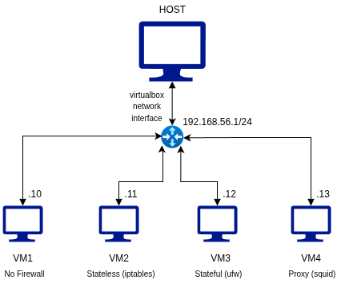

# AI Firewall Classification System



## Overview

The **AI Firewall Classification System** is a machine learning-based tool that automatically detects and classifies network firewall types based on their behavioral characteristics. The system analyzes network behavior patterns including ICMP responses, TCP port states, scan timing, SYN/ACK ratios, and HTTP header modifications to accurately identify firewall implementations.

## Project Objectives

This project aims to develop a lightweight machine learning classifier capable of:
- Automated firewall type detection from network behavior patterns
- Non-intrusive firewall fingerprinting without exploiting vulnerabilities
- Network security assessment through behavioral analysis
- Support for real-time classification of unknown network perimeters

## Firewall Classification

The system classifies networks into **4 distinct categories**:

| Label | Firewall Type | Key Characteristics |
|-------|--------------|---------------------|
| **0** | No Firewall | Responds to all packets, minimal filtering |
| **1** | Stateless | Port-based filtering, stateless packet inspection |
| **2** | Stateful | Connection tracking, session-aware filtering |
| **3** | Proxy | Application-layer filtering, HTTP header modification |

## Technology Stack

**Infrastructure:**
- Host OS: Kali Linux 2024+
- Virtualization: Oracle VirtualBox 7.0+
- Guest OS: Ubuntu Server 22.04 LTS

**Firewall Technologies:**
- iptables (Stateless filtering)
- ufw (Stateful filtering)
- Squid 6.x (HTTP proxy)

**Network Analysis Tools:**
- ping (ICMP testing)
- nmap (Port scanning)
- hping3 (TCP/IP packet crafting)
- curl (HTTP header analysis)

**Machine Learning:**
- Python 3.8+
- scikit-learn (Classification algorithms)
- pandas (Data manipulation)
- numpy (Numerical computations)
- matplotlib/seaborn (Visualization)

## Architecture

### Network Topology

```
                      [ Kali Host ]
                      192.168.56.1
                            |
                   vboxnet0 (Host-only)
    ________________________________________________
    |              |              |              |
192.168.56.10  192.168.56.11  192.168.56.12  192.168.56.13
    VM1             VM2            VM3            VM4
 No Firewall     Stateless      Stateful        Proxy
  (Baseline)     (iptables)       (ufw)        (Squid)
```

### Virtual Machine Configuration

| VM | Firewall Type | OS | vCPU | RAM | Storage | Network Mode | IP Address | OSI Layer | Implementation |
|----|--------------|-----|------|-----|---------|-------------|------------|-----------|----------------|
| **VM1** | No Firewall | Ubuntu 22.04 | 1 | 512 MB | 6 GB | Host-only | `192.168.56.10/24` | N/A | Baseline |
| **VM2** | Stateless | Ubuntu 22.04 | 1 | 512 MB | 6 GB | Host-only | `192.168.56.11/24` | Layer 3 | iptables |
| **VM3** | Stateful | Ubuntu 22.04 | 1 | 512 MB | 6 GB | Host-only | `192.168.56.12/24` | Layer 3-4 | ufw |
| **VM4** | Proxy | Ubuntu 22.04 | 1 | 768 MB | 8 GB | Host-only | `192.168.56.13/24` | Layer 7 | Squid |

## Firewall Configuration

### VM1: No Firewall (Baseline)

```bash
# No firewall configuration
# System accepts all incoming and outgoing traffic
# Used as baseline for comparison
```

**Purpose:** Establish baseline network behavior without filtering

### VM2: Stateless Firewall (iptables)

```bash
sudo apt update && sudo apt install -y iptables iptables-persistent

# Drop incoming SSH connections (port 22)
sudo iptables -A INPUT -p tcp --dport 22 -j DROP

# Save rules persistently
sudo netfilter-persistent save
```

**Purpose:** Demonstrate stateless packet filtering based on port numbers without connection tracking

### VM3: Stateful Firewall (ufw)

```bash
sudo apt update && sudo apt install -y ufw

# Enable firewall with default deny policy
sudo ufw default deny incoming
sudo ufw default allow outgoing
sudo ufw enable
```

**Purpose:** Implement stateful inspection that tracks connection states and only allows established connections

### VM4: Proxy Firewall (Squid)

```bash
sudo apt update && sudo apt install -y squid

# Configure Squid to allow all connections
sudo sed -i '/http_access deny all/i http_access allow all' /etc/squid/squid.conf

# Enable and start Squid service
sudo systemctl enable squid
sudo systemctl restart squid
```

**Purpose:** Demonstrate application-layer proxy that inspects and modifies HTTP traffic

## Feature Engineering

The machine learning model uses 11 stable behavioral features for classification:

### Layer 3 (Network Layer) Features
- **avg_latency**: Average round-trip time in milliseconds
- **packet_loss**: Percentage of lost ICMP packets
- **ttl_return**: Time-to-live value from ICMP responses
- **icmp_reachable**: Binary indicator of ICMP echo reply reception

### Layer 4 (Transport Layer) Features
- **filtered_ports_count**: Number of filtered TCP ports (1-1024 range)
- **scan_time**: Duration of port scan operation in seconds
- **syn_ack_ratio**: Ratio of SYN/ACK responses to SYN probes (port 80)
- **tcp_reset_ratio**: Ratio of RST responses to SYN probes (port 22)

### Layer 7 (Application Layer) Features
- **response_time**: HTTP response time in milliseconds
- **header_modified**: Binary indicator of proxy/cache header presence

### Target Variable
- **firewall_label**: Firewall classification (0-3)

## Getting Started

### Prerequisites

**Software Requirements:**
- Kali Linux or any Linux distribution with networking tools
- Oracle VirtualBox 7.0 or higher
- Ubuntu Server 22.04 LTS ISO image
- Python 3.8 or higher

**Hardware Requirements:**
- Minimum 8 GB RAM (for host and 4 VMs)
- 30 GB free disk space
- Multi-core processor with virtualization support (VT-x/AMD-V)

### Installation and Setup

#### Step 1: Create VirtualBox Host-Only Network

```bash
# Create host-only network adapter
VBoxManage hostonlyif create

# Configure network with IP 192.168.56.1/24
VBoxManage hostonlyif ipconfig vboxnet0 --ip 192.168.56.1 --netmask 255.255.255.0
```

#### Step 2: Deploy Virtual Machines

Create 4 Ubuntu Server VMs with specifications from the configuration table:
- Follow the network topology diagram
- Attach each VM to the host-only network (vboxnet0)
- Assign static IP addresses as specified
- Apply respective firewall configurations from the sections above

#### Step 3: Install Dependencies on Host

```bash
# Update package repository
sudo apt update

# Install network analysis tools
sudo apt install -y nmap hping3 curl

# Install Python and ML libraries
sudo apt install -y python3 python3-pip
pip3 install scikit-learn pandas numpy matplotlib seaborn
```

#### Step 4: Collect Training Data

```bash
# Collect data from all VMs (sequential)
sudo python3 data_collector.py \
  --targets 192.168.56.10,192.168.56.11,192.168.56.12,192.168.56.13 \
  --label-map 192.168.56.10=0,192.168.56.11=1,192.168.56.12=2,192.168.56.13=3 \
  --output dataset.csv

# Collect multiple samples (recommended: 30+ per VM)
sudo python3 data_collector.py \
  --targets-file targets.txt \
  --label-map 192.168.56.10=0,192.168.56.11=1,192.168.56.12=2,192.168.56.13=3 \
  --repeat 30 \
  --output dataset.csv
```

#### Step 5: Train Machine Learning Model

```bash
# Train classifier on collected data
python3 train_model.py --input dataset.csv --output model.pkl
```

#### Step 6: Classify Unknown Firewalls

```bash
# Classify a single target
sudo python3 classify.py --target <IP_ADDRESS> --model model.pkl

# Classify multiple targets
sudo python3 classify.py --targets-file unknown_hosts.txt --model model.pkl
```

## Expected Performance

The trained classification model should achieve the following metrics:

| Metric | Target Value | Description |
|--------|-------------|-------------|
| **Accuracy** | > 90% | Overall classification accuracy on test set |
| **Precision** | > 85% | Correctly identified positives per class |
| **Recall** | > 85% | Coverage of actual positives per class |
| **F1-Score** | > 85% | Harmonic mean of precision and recall |
| **Inference Time** | < 2 seconds | Time to classify a single target |
| **Training Time** | < 5 minutes | Model training duration (100+ samples) |

## Limitations and Considerations

**Ethical Use:**
- Only test on networks you own or have explicit authorization to scan
- Comply with local laws and regulations regarding network scanning
- Respect privacy and security policies of target networks

**Technical Limitations:**
- Requires sudo/root privileges for nmap and hping3
- Results may vary based on network conditions and latency
- Proxy detection requires accessible proxy ports (3128, 8080, 8888)
- Classification accuracy depends on training data quality and quantity

## Contributing

Contributions are welcome! Please follow these guidelines:
1. Fork the repository
2. Create a feature branch (`git checkout -b feature/improvement`)
3. Commit your changes (`git commit -am 'Add new feature'`)
4. Push to the branch (`git push origin feature/improvement`)
5. Create a Pull Request

## License

This project is for educational and research purposes only. Users are responsible for ensuring compliance with applicable laws and regulations.

## Author

**IkuzoMyDream**

GitHub: [https://github.com/winnietheSUii](https://github.com/winnietheSUii)

## Acknowledgments

This project was developed as part of network security research to understand firewall behavior classification through machine learning techniques.

---

If you find this project useful for your research or learning, please consider giving it a star on GitHub.