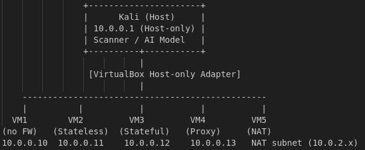

# 🔥 AI Firewall Classification System



## 📋 Overview

**AI Firewall Classification System** is an AI-powered firewall classification system that intelligently detects and identifies different types of network firewalls based on their behavioral characteristics. Using machine learning techniques, the system analyzes network behavior patterns such as ping responses, TTL differences, open ports, latency, and HTTP responses to accurately classify firewall types.

## 🎯 Project Goal

Build a lightweight AI classifier that detects firewall types from network behavior patterns, enabling automated network security assessment and firewall fingerprinting.

## 🏷️ Firewall Classification

The system classifies networks into **5 distinct categories**:

| Label | Firewall Type | Key Characteristics |
|-------|--------------|---------------------|
| **0** | No Firewall | Responds to all packets, multiple open ports |
| **1** | Stateless | Blocks specific ports, allows ping through |
| **2** | Stateful | Connection-aware, drops suspicious SYN packets |
| **3** | Proxy | Modifies HTTP headers, high latency |
| **4** | NAT | TTL changes, port mapping behavior |

## 🛠️ Technology Stack

- **Host OS**: Kali Linux
- **Virtualization**: VirtualBox
- **Guest OS**: Ubuntu Server 22.04
- **Firewall Tools**: iptables, ufw, Squid
- **Network Analysis**: ping, nmap, traceroute, HTTP requests
- **AI/ML**: Python (scikit-learn, pandas, numpy)

## 🏗️ Architecture

### Network Topology

```
                    [ Kali Host ]
                    192.168.56.1
                          |
                 vboxnet0 (Host-only)
    ________________________________________________
    |           |           |           |          |
192.168.56.10  .11         .12         .13        .14
   VM1         VM2         VM3         VM4        VM5
  NoFW      Stateless    Stateful     Proxy       NAT
```

### Virtual Machine Configuration

| VM | Firewall Type | OS | CPU | RAM | Disk | Network | IP Address | Layer | Tool |
|----|--------------|-----|-----|-----|------|---------|------------|-------|------|
| **VM1** | No Firewall | Ubuntu 22.04 | 1 | 512 MB | 6 GB | Host-only | `192.168.56.10/24` | — | — |
| **VM2** | Stateless | Ubuntu 22.04 | 1 | 512 MB | 6 GB | Host-only | `192.168.56.11/24` | L3 | iptables |
| **VM3** | Stateful | Ubuntu 22.04 | 1 | 512 MB | 6 GB | Host-only | `192.168.56.12/24` | L3/L4 | ufw |
| **VM4** | Proxy | Ubuntu 22.04 | 1 | 768 MB | 8 GB | Host-only | `192.168.56.13/24` | L7 | Squid |
| **VM5** | NAT | Ubuntu 22.04 | 1 | 512 MB | 6 GB | NAT + Host-only | `192.168.56.14/24` | L3 | VirtualBox NAT |

## ⚙️ Firewall Configuration

### VM1: No Firewall (Baseline)
```bash
# No configuration needed
# All ports open, responds to all traffic
```

### VM2: Stateless Firewall
```bash
sudo apt install iptables -y
sudo iptables -A INPUT -p tcp --dport 22 -j DROP
sudo apt install iptables-persistent -y
sudo netfilter-persistent save
```
**Purpose**: Drop packets on specific ports (e.g., SSH port 22)

### VM3: Stateful Firewall
```bash
sudo apt install ufw -y
sudo ufw enable
sudo ufw default deny incoming
sudo ufw allow out
```
**Purpose**: Connection-based traffic inspection (allow only internally-initiated connections)

### VM4: Proxy Firewall
```bash
sudo apt install squid -y
sudo systemctl enable squid
sudo systemctl start squid
# Allow all clients
sudo sed -i '/http_access deny all/i http_access allow all' /etc/squid/squid.conf
sudo systemctl restart squid
```
**Purpose**: Simulate L7 proxy that modifies HTTP headers and adds latency

### VM5: NAT
```bash
# No OS configuration needed
# Configure in VirtualBox:
# - Adapter 1: NAT
# - Adapter 2: Host-only (vboxnet0)
```
**Purpose**: Simulate NAT behavior with TTL and source IP translation

## 🔍 Feature Engineering

The AI model analyzes the following network characteristics:

- **ICMP Responses**: Ping success rate, response time
- **TTL Analysis**: Time-to-live values and differences
- **Port Scanning**: Open/closed/filtered port patterns
- **Connection Behavior**: TCP handshake patterns, stateful vs stateless
- **Latency Metrics**: Response times, jitter
- **HTTP Headers**: Presence of proxy headers, modifications
- **Packet Loss**: Drop rates for different protocols

## 🚀 Getting Started

### Prerequisites
- Kali Linux (or any Linux distribution)
- VirtualBox installed
- Ubuntu Server 22.04 ISO
- Python 3.8+ for ML model

### Setup Instructions

1. **Create VirtualBox Host-only Network**
   ```bash
   VBoxManage hostonlyif create
   VBoxManage hostonlyif ipconfig vboxnet0 --ip 192.168.56.1
   ```

2. **Deploy Virtual Machines**
   - Create 5 Ubuntu VMs following the configuration table above
   - Configure network adapters as specified
   - Apply firewall configurations

3. **Install Dependencies (on Kali Host)**
   ```bash
   sudo apt update
   sudo apt install -y nmap hping3 curl python3-pip
   pip3 install scikit-learn pandas numpy matplotlib seaborn
   ```

4. **Collect Training Data**
   ```bash
   # Run network scans and collect features
   python3 data_collector.py
   ```

5. **Train the Model**
   ```bash
   python3 train_model.py
   ```

6. **Classify Unknown Firewalls**
   ```bash
   python3 classify.py --target <IP_ADDRESS>
   ```

## 📊 Expected Results

The trained model should achieve:
- **Accuracy**: >90% on test set
- **Inference Time**: <2 seconds per target
- **False Positive Rate**: <5%

## 🤝 Contributing

Contributions are welcome! Please feel free to submit a Pull Request.

## 📝 License

This project is for educational purposes only. Use responsibly and only on networks you own or have permission to test.

## 👨‍💻 Author

**IkuzoMyDream**

---

⭐ If you find this project useful, please consider giving it a star!